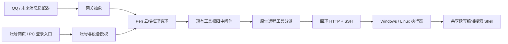

# 架构与权限

## 模块

| 模块 | 职责 |
| --- | --- |
| peri-cloud | 云端推理宿主、身份、账号网页、可选网关、持久化调度 |
| peri-executor | 原生工具执行、任务日志、本机 OAuth 登录、设备发起的 SSH 隧道 |
| peri-remote-tools | 云端的原生远程工具协议与分派 |
| peri-tool-runtime | 两端共享的文件与 Shell 工具实现 |
| peri-acp-types | 身份、交互和设备执行的公共数据契约 |
| peri-agent / peri-middlewares / peri-model | 原有推理循环、权限和模型接口 |
| peri-process / peri-resources / peri-workflow / peri-lsp / peri-js-runtime | 上述模块需要的基础依赖 |

发布源码还保留 `peri-acp/prompts` 中被编译期引用的提示词资源；不包含 ACP 宿主、TUI 或其界面代码。

## 账号、设备与连接

电脑登录使用 OAuth 授权码与 PKCE S256，通过临时回环回调完成本机授权确认。身份、运输连接与工具权限各有不同职责：

- 账号网页决定哪个设备与聊天账号属于你。
- SSH 配置与运输令牌决定云端如何认证、连接执行器。
- 当前聊天会话的 Peri 权限模式决定哪些工具需要审批。

OAuth 不把 SSH 用户名、私钥或运输令牌自动塞入工具参数。模型只收到必要的工具参数；实际执行连接由宿主持有。每次任务冻结设备与工作区，切换设备不会改变正在执行的旧任务。

QQ 绑定口令五分钟有效、只能使用一次。发送口令只生成关联申请；最后由已登录的电脑账号核对完整聊天身份并确认。

## 工作区

路径选择属于账号 / 会话控制，不进入运输配置。QQ 支持 `/工作区` 和带绝对路径的 `/连接`；网页从认证账号解析当前聊天路由，请求只提供预期会话 ID 与目录。执行器验证并规范化目录后，网关新建冻结会话，保留权限模式，再提交路由选择。原会话与历史不改写。

切换和入站路由共用串行门；浏览器切换任务由部署者持有，即使 HTTP 请求断开也完成结算。过期会话 ID、已撤销身份和设备、运行中或未确认执行均不能改变选择。已知路径从自有设备历史中读取，服务重启后恢复当前选择。

## 审批

云端沿用 PermissionMiddleware。执行器不实现第二层工具审批，但验证运输认证、协议、工作区与任务身份。

QQ 按钮允许点击到达网关。后台使用平台观察到的发送者、聊天路由和待审批请求验证归属，拒绝错误账号、过期请求和重复提交。网页使用会话 Cookie、CSRF 及同源验证。

QQ 卡片只提供限长摘要，Write / Edit 正文留在登录后的完整参数中。多项工具操作保留总数与详情入口，不把部分预览当作整批授权范围。

## 运行生命周期

SQLite 日志记录入站消息、会话、云任务、审批、执行器任务及发件状态。任务 ID 用于去重和恢复查询。连接进程创建不等于在线，只有通过认证与协议校验的执行器才能被选中。

服务停机先停止接纳任务，再结算自己拥有的工作。未知执行结果保留恢复状态；未知发件结果不自动重投。杀进程等强制中断不能当作成功取消。

## 扩展

网关适配器负责各平台的消息归一化和投递，不拥有推理循环。QQ 只是当前适配器；添加微信时可以复用账号、会话和审批基础设施。

远程工具协议为其他工具留有扩展空间，当前云端会话注册核心读写、编辑、文件查找、内容搜索和 Shell。长期记忆后端及 Wake-on-LAN 节点尚未交付。